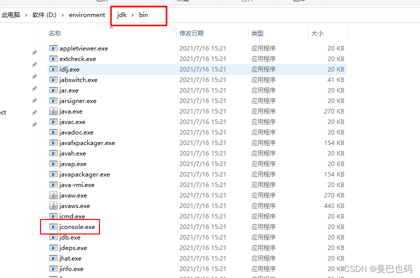
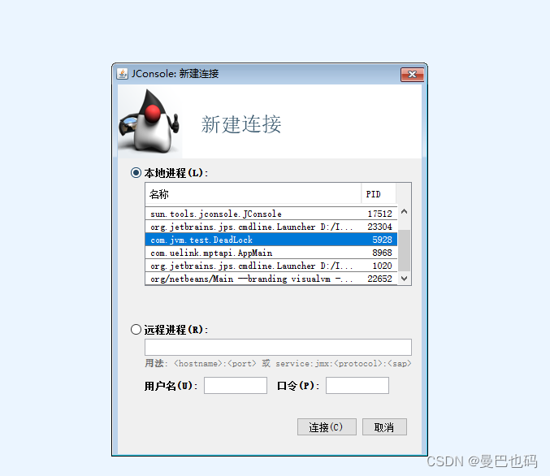
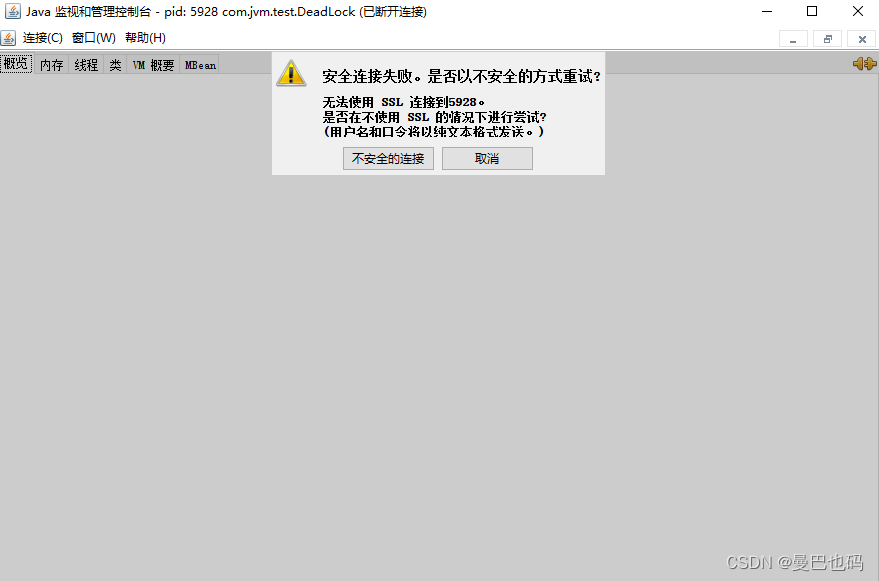
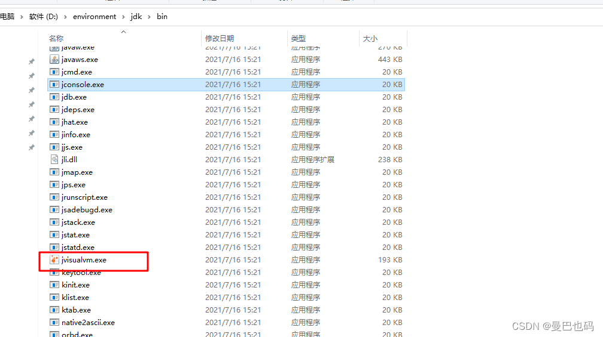
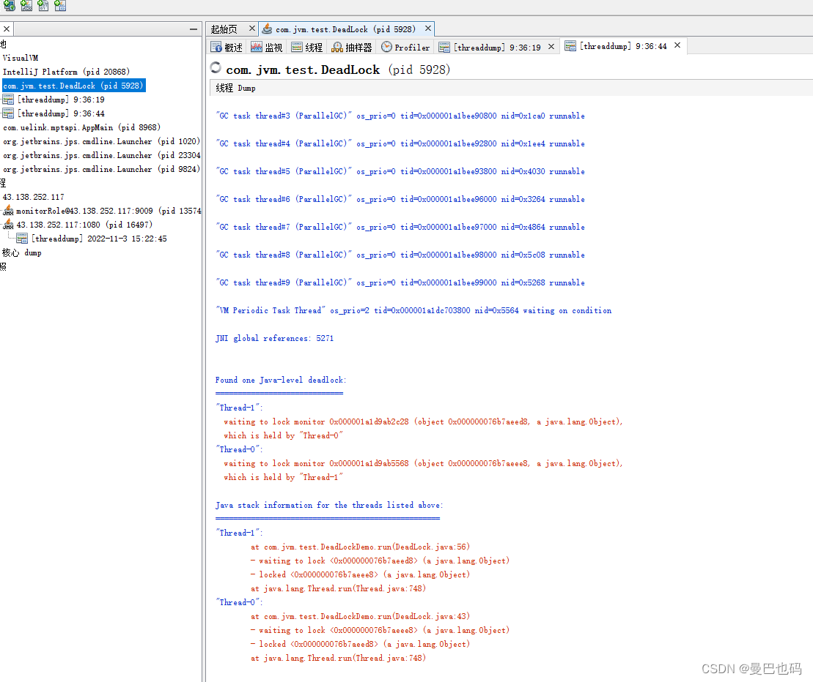

# 21.你的项目死锁怎么检测的

# 21.你的项目死锁怎么检测的

如果程序出现死锁问题，可通过以下 3种方案中的任意一种进行分析和排查。  
方案一：jstack  
在使用 jstack 之前，我们需要先通过 jps -l得到运行程序的进程 ID，使用方法如下：

有了进程 ID(PID)之后，我们就可以使用“jstack -l PID”来发现死锁问题了，如下图所示：

方案二：jconsole  
jconsole工具位于jdk的bin目录下，如图：

双击进入，选择要调试的程序，如下图所示：

会出现如下提示，选择不安全的链接

点击线程栏目，然后点下面死锁，就会检测出来了

方案三：jvisualvm  
jvisualvm 也在 JDK 的 bin 目录中，同样是双击打开：

点击线程栏目，如果发生死锁，会自动提示如下：

点击线程dump:

以上是jdk8以上版本排查线程死锁的常用三种方案，还有一种是根据jmc（Oracle Java Mission Control ）排查，jmc是一个对 Java 程序进行管理、监控、概要分析和故障排查的工具套件，它也是在 JDK 的 bin 目录中。但是jdk1.8之后，jmc就已经不随着jdk一起发出去了，如果想要使用jmc对jvm进行监控，这时候需要手工下载jmc，然后在本地运行。oracle官网比较坑，现在只有jmc8.1版本下载，它需要jdk11,但作者暂时还没亲自试过，所以先不写了。

> 更新: 2024-04-19 15:34:26  
> 原文: <https://www.yuque.com/linuxer/gscfv1/43422eb9d31541ca12bd570de685b076>