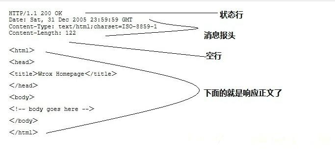

# 08.http服务器，他的目标是什么，通过什么方式实现的

# 08.http服务器，他的目标是什么，通过什么方式实现的


## 1.对于HTTP的简单理解


### 1.1 http服务器简介


HTTP 协议是 Hyper Text Transfer Protocol（超文本传输协议）的缩写,是用于从万维网(WWW:World Wide Web)服务器传输超文本到本地浏览器的传送协议。HTTP 是一个基于TCP/IP 通信协议来传递数据（HTML 文件, 图片文件, 查询结果等）


### 1.2 http工作原理


http协议工作于客户端-服务端架构上，浏览器作为http客户端通过URL向http服务器即web服务器发送所有请求，web服务器根据接收到的请求向客户端发送响应信息，http端口默认为80端口


注意事项


+  http是无连接的，就是一次只能处理一个请求处理完请求后给客户发送应答，断开连接 
+  http是媒体独立的，客户端和服务端只知道如何处理数据内容，任何类型的数据都可以通过http发送，客户端和服务器指定使用合适的MIME-type内容类型 
+  http是无状态的，对于事务处理没有记忆，缺少状态信息保存 


### 1.3 http消息结构


+  HTTP 是基于客户端/服务端（C/S）的架构模型，通过一个可靠的链接来交换信息，是一个无 
+  状态的请求/响应协议 
+  一个 HTTP"客户端"是一个应用程序（Web 浏览器或其他任何客户端），通过连接到服务器达 
+  到向服务器发送一个或多个 HTTP 的请求的目的 
+  一个 HTTP"服务器"同样也是一个应用程序（通常是一个 Web 服务，如 Apache Web 服务器 
+  或 IIS 服务器等），通过接收客户端的请求并向客户端发送 HTTP 响应数据 
+  HTTP 使用统一资源标识符（Uniform Resource Identifiers, URI）来传输数据和建立连接 


### 1.4 客户端请求消息


客户端发送一个http请求到服务器的请求消息包括以下格式：请求行、请求头部、空行和请求数据四个部分


客户端请求示例


```plain
GET /hello.txt HTTP/1.1
User-Agent: curl/7.16.3 libcurl/7.16.3 OpenSSL/0.9.7l zlib/1.2.3
Host: www.example.com
Accept-Language: en, mi
```


服务器响应信息  
http响应也由四个部分组成，分别是：状态行、消息报头、空行和响应正文





GET请求服务端响应示例：


```plain
HTTP/1.1 200 OK
Date: Mon, 27 Jul 2009 12:28:53 GMT
Server: Apache
Last-Modified: Wed, 22 Jul 2009 19:15:56 GMT
ETag: "34aa387-d-1568eb00"
Accept-Ranges: bytes
Content-Length: 51
Vary: Accept-Encoding
Content-Type: text/plain
```


输出结果：


```plain
Hello World! My payload includes a trailing CRLF.
```


### 1.5 HTTP的请求方法


根据HTTP标准，http可以有多种请求方法


HTTP1.0 定义了三种请求方法： GET, POST 和 HEAD 方法


HTTP1.1 新增了六种请求方法：OPTIONS、PUT、PATCH、DELETE、TRACE 和 CONNECT 方法


### 1.6 HTTP响应头信息


HTTP 请求头提供了关于请求，响应或者其他的发送实体的信息


### 1.7 HTTP状态码


当浏览者访问一个网页时，浏览者的浏览器会向网页所在服务器发出请求。当浏览器接收并显示网页前，此网页所在的服务器会返回一个包含 HTTP 状态码的信息头（server header)用以响应浏览器的请求。HTTP 状态码的英文为 HTTP Status Code


#### 1.7.1 五种类型状态码


#### 1.7.2 状态码列表


## 2.HTTP的实现


本设计使用Reactor模型实现一个http服务器，Reactor模型不再过多赘述，可以看我另外一篇专门讲Reactor的博客，本文主要讲建立TCP连接，接受客户端请求和发送HTTP响应，这也是一个http连接的生命周期


### 2.1 建立TCP连接


这一步的应用场景一般是对连接进行检验，比如


1.  ip限制检查 
2.  负载均衡 


```plain
int accept_cb(int fd, int events, void *arg) {

	struct ntyreactor *reactor = (struct ntyreactor*)arg;
	if (reactor == NULL) return -1;
	
	struct sockaddr_in client_addr;
	socklen_t len = sizeof(client_addr);
	
	int clientfd;
	
	if ((clientfd = accept(fd, (struct sockaddr*)&client_addr, &len)) == -1) {
		if (errno != EAGAIN && errno != EINTR) {
			
		}
		printf("accept: %s\n", strerror(errno));
		return -1;
	}
	int flag = 0;
	if ((flag = fcntl(clientfd, F_SETFL, O_NONBLOCK)) < 0) {
		printf("%s: fcntl nonblocking failed, %d\n", __func__, MAX_EPOLL_EVENTS);
		return -1;
	}
	struct ntyevent *event = ntyreactor_idx(reactor, clientfd);
	
	nty_event_set(event, clientfd, recv_cb, reactor);
	nty_event_add(reactor->epfd, EPOLLIN, event);
	printf("new connect [%s:%d], pos[%d]\n", 
		inet_ntoa(client_addr.sin_addr), ntohs(client_addr.sin_port), clientfd);
	
	return 0;

}
```


### 2.2 接受http请求


```plain
int recv_cb(int fd, int events, void *arg) {

	struct ntyreactor *reactor = (struct ntyreactor*)arg;
	struct ntyevent *ev = ntyreactor_idx(reactor, fd);
	
	int len = recv(fd, ev->buffer, BUFFER_LENGTH , 0); //接受一个http请求
	nty_event_del(reactor->epfd, ev);
	
	if (len > 0) {
		ev->length = len;
		ev->buffer[len] = '\0';
		printf("C[%d]:%s\n", fd, ev->buffer);
		nty_event_set(ev, fd, send_cb, reactor);
		nty_event_add(reactor->epfd, EPOLLOUT, ev);
	} else if (len == 0) {
	
		close(ev->fd);
		//printf("[fd=%d] pos[%ld], closed\n", fd, ev-reactor->events);
	} else {
		close(ev->fd);
		printf("recv[fd=%d] error[%d]:%s\n", fd, errno, strerror(errno));
	}
	return len;

}
```


### 2.3http协议解析


处理客户端发来的请求报文前要先弄清楚是什么请求报文，下面以GET和POST请求为例


```plain
int http_request(struct ntyevent *ev) {

	// GET, POST
	char linebuf[1024] = {0};
	int idx = readline(ev->buffer, 0, linebuf);
	
	if (strstr(linebuf, "GET")) {
		ev->method = HTTP_METHOD_GET;
		//uri
		int i = 0;
		while (linebuf[sizeof("GET ") + i] != ' ') i++;
		linebuf[sizeof("GET ")+i] = '\0';
		sprintf(ev->resource, "./%s/%s", HTTP_WEBSERVER_HTML_ROOT, linebuf+sizeof("GET "));
	} else if (strstr(linebuf, "POST")) {
	}

}
```


### 2.4 http协议处理


http是一个超文本传输协议，这个函数是对文本进行处理


```plain
int http_response(struct ntyevent *ev) {
	if (ev == NULL) return -1;
	memset(ev->buffer, 0, BUFFER_LENGTH);
#if 0
	const char *html = "<html><head><title>hello http</title></head><body><H1>King</H1></body></html>\r\n\r\n";					  	   
	ev->length = sprintf(ev->buffer, 
		"HTTP/1.1 200 OK\r\n\
		 Date: Thu, 11 Nov 2021 12:28:52 GMT\r\n\
		 Content-Type: text/html;charset=ISO-8859-1\r\n\
		 Content-Length: 83\r\n\r\n%s", 
		 html);
	
#else

	printf("resource: %s\n", ev->resource);
	
	int filefd = open(ev->resource, O_RDONLY);
	if (filefd == -1) { // return 404
	
		ev->ret_code = 404;
		ev->length = sprintf(ev->buffer, 
			"HTTP/1.1 404 Not Found\r\n"
		 	"Date: Thu, 11 Nov 2021 12:28:52 GMT\r\n"
		 	"Content-Type: text/html;charset=ISO-8859-1\r\n"
			"Content-Length: 85\r\n\r\n"
		 	"<html><head><title>404 Not Found</title></head><body><H1>404</H1></body></html>\r\n\r\n" );
	} else {
		struct stat stat_buf;
		fstat(filefd, &stat_buf);
		close(filefd);
	
		if (S_ISDIR(stat_buf.st_mode)) {		
			ev->ret_code = 404;
			ev->length = sprintf(ev->buffer, 
				"HTTP/1.1 404 Not Found\r\n"
				"Date: Thu, 11 Nov 2021 12:28:52 GMT\r\n"
				"Content-Type: text/html;charset=ISO-8859-1\r\n"
				"Content-Length: 85\r\n\r\n"
				"<html><head><title>404 Not Found</title></head><body><H1>404</H1></body></html>\r\n\r\n" );
		} else if (S_ISREG(stat_buf.st_mode)) {
			ev->ret_code = 200;
			ev->length = sprintf(ev->buffer, 
				"HTTP/1.1 200 OK\r\n"
			 	"Date: Thu, 11 Nov 2021 12:28:52 GMT\r\n"
			 	"Content-Type: text/html;charset=ISO-8859-1\r\n"
				"Content-Length: %ld\r\n\r\n", 
			 		stat_buf.st_size );
		}
	}

#endif
	return ev->length;
}
```


### 2.5 发送HTTP响应


```plain
int send_cb(int fd, int events, void *arg) {

	struct ntyreactor *reactor = (struct ntyreactor*)arg;
	struct ntyevent *ev = ntyreactor_idx(reactor, fd);
	
	http_response(ev);
	//
	int len = send(fd, ev->buffer, ev->length, 0);
	if (len > 0) {
		printf("send[fd=%d], [%d]%s\n", fd, len, ev->buffer);
	
		if (ev->ret_code == 200) {
			int filefd = open(ev->resource, O_RDONLY);
			struct stat stat_buf;
			fstat(filefd, &stat_buf);
	
			sendfile(fd, filefd, NULL, stat_buf.st_size);
			close(filefd);
		}
		nty_event_del(reactor->epfd, ev);
		nty_event_set(ev, fd, recv_cb, reactor);
		nty_event_add(reactor->epfd, EPOLLIN, ev);
	} else {
		close(ev->fd);
		nty_event_del(reactor->epfd, ev);
		printf("send[fd=%d] error %s\n", fd, strerror(errno));
	}
	return len;

}
```


### 2.6 全部代码附录


```plain
#include <stdio.h>
#include <stdlib.h>
#include <string.h>
#include <sys/socket.h>
#include <sys/epoll.h>
#include <arpa/inet.h>
#include <fcntl.h>
#include <unistd.h>
#include <errno.h>
#include <time.h>
#include <sys/stat.h>
#include <sys/sendfile.h>


#define BUFFER_LENGTH		4096
#define MAX_EPOLL_EVENTS	1024
#define SERVER_PORT			8888
#define PORT_COUNT			1


#define HTTP_WEBSERVER_HTML_ROOT	"html"


#define HTTP_METHOD_GET		0
#define HTTP_METHOD_POST	1

typedef int NCALLBACK(int ,int, void*);

struct ntyevent {
	int fd;
	int events;
	void *arg;
	int (*callback)(int fd, int events, void *arg);
	

	int status;
	char buffer[BUFFER_LENGTH];
	int length;
	long last_active;
	
	// http param
	int method; //
	char resource[BUFFER_LENGTH];
	int ret_code;


​	
};

struct eventblock {

	struct eventblock *next;
	struct ntyevent *events;

};

struct ntyreactor {
	int epfd;
	int blkcnt;
	struct eventblock *evblk; //fd --> 100w
};


int recv_cb(int fd, int events, void *arg);
int send_cb(int fd, int events, void *arg);
struct ntyevent *ntyreactor_idx(struct ntyreactor *reactor, int sockfd);


void nty_event_set(struct ntyevent *ev, int fd, NCALLBACK callback, void *arg) {

	ev->fd = fd;
	ev->callback = callback;
	ev->events = 0;
	ev->arg = arg;
	ev->last_active = time(NULL);
	
	return ;

}


int nty_event_add(int epfd, int events, struct ntyevent *ev) {

	struct epoll_event ep_ev = {0, {0}};
	ep_ev.data.ptr = ev;
	ep_ev.events = ev->events = events;
	
	int op;
	if (ev->status == 1) {
		op = EPOLL_CTL_MOD;
	} else {
		op = EPOLL_CTL_ADD;
		ev->status = 1;
	}
	
	if (epoll_ctl(epfd, op, ev->fd, &ep_ev) < 0) {
		printf("event add failed [fd=%d], events[%d]\n", ev->fd, events);
		return -1;
	}
	
	return 0;

}

int nty_event_del(int epfd, struct ntyevent *ev) {

	struct epoll_event ep_ev = {0, {0}};
	
	if (ev->status != 1) {
		return -1;
	}
	
	ep_ev.data.ptr = ev;
	ev->status = 0;
	epoll_ctl(epfd, EPOLL_CTL_DEL, ev->fd, &ep_ev);
	
	return 0;

}


int readline(char *allbuf, int idx, char *linebuf) {

	int len = strlen(allbuf);
	
	for(;idx < len;idx ++) {
		if (allbuf[idx] == '\r' && allbuf[idx+1] == '\n') {
			return idx+2;
		} else {
			*(linebuf++) = allbuf[idx];
		}
	}
	
	return -1;

}

int http_request(struct ntyevent *ev) {

	// GET, POST
	char linebuf[1024] = {0};
	int idx = readline(ev->buffer, 0, linebuf);
	
	if (strstr(linebuf, "GET")) {
		ev->method = HTTP_METHOD_GET;
	
		//uri
		int i = 0;
		while (linebuf[sizeof("GET ") + i] != ' ') i++;
		linebuf[sizeof("GET ")+i] = '\0';
	
		sprintf(ev->resource, "./%s/%s", HTTP_WEBSERVER_HTML_ROOT, linebuf+sizeof("GET "));
		
	} else if (strstr(linebuf, "POST")) {
	
	}

}

int recv_cb(int fd, int events, void *arg) {

	struct ntyreactor *reactor = (struct ntyreactor*)arg;
	struct ntyevent *ev = ntyreactor_idx(reactor, fd);
	
	int len = recv(fd, ev->buffer, BUFFER_LENGTH, 0); // 
	
	if (len > 0) {
		
		ev->length = len;
		ev->buffer[len] = '\0';
	
		printf("C[%d]:%s\n", fd, ev->buffer); //http
	
		http_request(ev);
	
		//send();
		
		nty_event_del(reactor->epfd, ev);
		nty_event_set(ev, fd, send_cb, reactor);
		nty_event_add(reactor->epfd, EPOLLOUT, ev);


​		

	} else if (len == 0) {
	
		nty_event_del(reactor->epfd, ev);
		close(ev->fd);
		//printf("[fd=%d] pos[%ld], closed\n", fd, ev-reactor->events);
		 
	} else {
	
		nty_event_del(reactor->epfd, ev);
		close(ev->fd);
		printf("recv[fd=%d] error[%d]:%s\n", fd, errno, strerror(errno));
		
	}
	
	return len;

}


int http_response(struct ntyevent *ev) {

	if (ev == NULL) return -1;
	memset(ev->buffer, 0, BUFFER_LENGTH);

#if 0
	const char *html = "<html><head><title>hello http</title></head><body><H1>King</H1></body></html>\r\n\r\n";
						  	   

	ev->length = sprintf(ev->buffer, 
		"HTTP/1.1 200 OK\r\n\
		 Date: Thu, 11 Nov 2021 12:28:52 GMT\r\n\
		 Content-Type: text/html;charset=ISO-8859-1\r\n\
		 Content-Length: 83\r\n\r\n%s", 
		 html);

#else

	printf("resource: %s\n", ev->resource);
	
	int filefd = open(ev->resource, O_RDONLY);
	if (filefd == -1) { // return 404
	
		ev->ret_code = 404;
		ev->length = sprintf(ev->buffer, 
			"HTTP/1.1 404 Not Found\r\n"
		 	"Date: Thu, 11 Nov 2021 12:28:52 GMT\r\n"
		 	"Content-Type: text/html;charset=ISO-8859-1\r\n"
			"Content-Length: 85\r\n\r\n"
		 	"<html><head><title>404 Not Found</title></head><body><H1>404</H1></body></html>\r\n\r\n" );
	
	} else {


		struct stat stat_buf;
		fstat(filefd, &stat_buf);
		close(filefd);
	
		if (S_ISDIR(stat_buf.st_mode)) {


​			

			ev->ret_code = 404;
			ev->length = sprintf(ev->buffer, 
				"HTTP/1.1 404 Not Found\r\n"
				"Date: Thu, 11 Nov 2021 12:28:52 GMT\r\n"
				"Content-Type: text/html;charset=ISO-8859-1\r\n"
				"Content-Length: 85\r\n\r\n"
				"<html><head><title>404 Not Found</title></head><body><H1>404</H1></body></html>\r\n\r\n" );
	
		} else if (S_ISREG(stat_buf.st_mode)) {
	
			ev->ret_code = 200;
	
			ev->length = sprintf(ev->buffer, 
				"HTTP/1.1 200 OK\r\n"
			 	"Date: Thu, 11 Nov 2021 12:28:52 GMT\r\n"
			 	"Content-Type: text/html;charset=ISO-8859-1\r\n"
				"Content-Length: %ld\r\n\r\n", 
			 		stat_buf.st_size );
		}
	
	}

#endif
	return ev->length;
}

int send_cb(int fd, int events, void *arg) {

	struct ntyreactor *reactor = (struct ntyreactor*)arg;
	struct ntyevent *ev = ntyreactor_idx(reactor, fd);
	
	http_response(ev);
	//
	int len = send(fd, ev->buffer, ev->length, 0);
	if (len > 0) {
		printf("send[fd=%d], [%d]%s\n", fd, len, ev->buffer);
	
		if (ev->ret_code == 200) {
			int filefd = open(ev->resource, O_RDONLY);
			struct stat stat_buf;
			fstat(filefd, &stat_buf);
	
			sendfile(fd, filefd, NULL, stat_buf.st_size);
			close(filefd);
		}
		nty_event_del(reactor->epfd, ev);
		nty_event_set(ev, fd, recv_cb, reactor);
		nty_event_add(reactor->epfd, EPOLLIN, ev);
		
	} else {
		close(ev->fd);
	
		nty_event_del(reactor->epfd, ev);
		printf("send[fd=%d] error %s\n", fd, strerror(errno));
	}
	return len;

}

int accept_cb(int fd, int events, void *arg) {

	struct ntyreactor *reactor = (struct ntyreactor*)arg;
	if (reactor == NULL) return -1;
	
	struct sockaddr_in client_addr;
	socklen_t len = sizeof(client_addr);
	
	int clientfd;
	
	if ((clientfd = accept(fd, (struct sockaddr*)&client_addr, &len)) == -1) {
		if (errno != EAGAIN && errno != EINTR) {
			
		}
		printf("accept: %s\n", strerror(errno));
		return -1;
	}
	
	int flag = 0;
	if ((flag = fcntl(clientfd, F_SETFL, O_NONBLOCK)) < 0) {
		printf("%s: fcntl nonblocking failed, %d\n", __func__, MAX_EPOLL_EVENTS);
		return -1;
	}
	
	struct ntyevent *event = ntyreactor_idx(reactor, clientfd);
	
	nty_event_set(event, clientfd, recv_cb, reactor);
	nty_event_add(reactor->epfd, EPOLLIN, event);
	
	printf("new connect [%s:%d], pos[%d]\n", 
		inet_ntoa(client_addr.sin_addr), ntohs(client_addr.sin_port), clientfd);
	
	return 0;

}

int init_sock(short port) {

	int fd = socket(AF_INET, SOCK_STREAM, 0);
	fcntl(fd, F_SETFL, O_NONBLOCK);
	
	struct sockaddr_in server_addr;
	memset(&server_addr, 0, sizeof(server_addr));
	server_addr.sin_family = AF_INET;
	server_addr.sin_addr.s_addr = htonl(INADDR_ANY);
	server_addr.sin_port = htons(port);
	
	bind(fd, (struct sockaddr*)&server_addr, sizeof(server_addr));
	
	if (listen(fd, 20) < 0) {
		printf("listen failed : %s\n", strerror(errno));
	}
	return fd;

}


int ntyreactor_alloc(struct ntyreactor *reactor) {

	if (reactor == NULL) return -1;
	if (reactor->evblk == NULL) return -1;
	
	struct eventblock *blk = reactor->evblk;
	while (blk->next != NULL) {
		blk = blk->next;
	}
	
	struct ntyevent *evs = (struct ntyevent*)malloc((MAX_EPOLL_EVENTS) * sizeof(struct ntyevent));
	if (evs == NULL) {
		printf("ntyreactor_alloc ntyevents failed\n");
		return -2;
	}
	memset(evs, 0, (MAX_EPOLL_EVENTS) * sizeof(struct ntyevent));
	
	struct eventblock *block = (struct eventblock *)malloc(sizeof(struct eventblock));
	if (block == NULL) {
		printf("ntyreactor_alloc eventblock failed\n");
		return -2;
	}
	memset(block, 0, sizeof(struct eventblock));
	
	block->events = evs;
	block->next = NULL;
	
	blk->next = block;
	reactor->blkcnt ++; //
	
	return 0;

}

struct ntyevent *ntyreactor_idx(struct ntyreactor *reactor, int sockfd) {

	int blkidx = sockfd / MAX_EPOLL_EVENTS;
	
	while (blkidx >= reactor->blkcnt) {
		ntyreactor_alloc(reactor);
	}
	
	int i = 0;
	struct eventblock *blk = reactor->evblk;
	while(i ++ < blkidx && blk != NULL) {
		blk = blk->next;
	}
	
	return &blk->events[sockfd % MAX_EPOLL_EVENTS];

}


int ntyreactor_init(struct ntyreactor *reactor) {

	if (reactor == NULL) return -1;
	memset(reactor, 0, sizeof(struct ntyreactor));
	
	reactor->epfd = epoll_create(1);
	if (reactor->epfd <= 0) {
		printf("create epfd in %s err %s\n", __func__, strerror(errno));
		return -2;
	}
	
	struct ntyevent *evs = (struct ntyevent*)malloc((MAX_EPOLL_EVENTS) * sizeof(struct ntyevent));
	if (evs == NULL) {
		printf("ntyreactor_alloc ntyevents failed\n");
		return -2;
	}
	memset(evs, 0, (MAX_EPOLL_EVENTS) * sizeof(struct ntyevent));
	
	struct eventblock *block = (struct eventblock *)malloc(sizeof(struct eventblock));
	if (block == NULL) {
		printf("ntyreactor_alloc eventblock failed\n");
		return -2;
	}
	memset(block, 0, sizeof(struct eventblock));
	
	block->events = evs;
	block->next = NULL;
	
	reactor->evblk = block;
	reactor->blkcnt = 1;
	
	return 0;

}

int ntyreactor_destory(struct ntyreactor *reactor) {

	close(reactor->epfd);
	//free(reactor->events);
	
	struct eventblock *blk = reactor->evblk;
	struct eventblock *blk_next = NULL;
	
	while (blk != NULL) {
	
		blk_next = blk->next;
	
		free(blk->events);
		free(blk);
		blk = blk_next;
	}
	return 0;

}


int ntyreactor_addlistener(struct ntyreactor *reactor, int sockfd, NCALLBACK *acceptor) {

	if (reactor == NULL) return -1;
	if (reactor->evblk == NULL) return -1;
	//reactor->evblk->events[sockfd];
	struct ntyevent *event = ntyreactor_idx(reactor, sockfd);
	nty_event_set(event, sockfd, acceptor, reactor);
	nty_event_add(reactor->epfd, EPOLLIN, event);
	
	return 0;

}

int ntyreactor_run(struct ntyreactor *reactor) {
	if (reactor == NULL) return -1;
	if (reactor->epfd < 0) return -1;
	if (reactor->evblk == NULL) return -1;
	

	struct epoll_event events[MAX_EPOLL_EVENTS+1];
	
	int checkpos = 0, i;
	
	while (1) {

/*
		long now = time(NULL);
		for (i = 0;i < 100;i ++, checkpos ++) {
			if (checkpos == MAX_EPOLL_EVENTS) {
				checkpos = 0;
			}

			if (reactor->events[checkpos].status != 1) {
				continue;
			}
	
			long duration = now - reactor->events[checkpos].last_active;
	
			if (duration >= 60) {
				close(reactor->events[checkpos].fd);
				printf("[fd=%d] timeout\n", reactor->events[checkpos].fd);
				nty_event_del(reactor->epfd, &reactor->events[checkpos]);
			}
		}

*/

		int nready = epoll_wait(reactor->epfd, events, MAX_EPOLL_EVENTS, 1000);
		if (nready < 0) {
			printf("epoll_wait error, exit\n");
			continue;
		}
	
		for (i = 0;i < nready;i ++) {
	
			struct ntyevent *ev = (struct ntyevent*)events[i].data.ptr;
	
			if ((events[i].events & EPOLLIN) && (ev->events & EPOLLIN)) {
				ev->callback(ev->fd, events[i].events, ev->arg);
			}
			if ((events[i].events & EPOLLOUT) && (ev->events & EPOLLOUT)) {
				ev->callback(ev->fd, events[i].events, ev->arg);
			}		
		}
	}

}

// 3, 6w, 1, 100 == 
// <remoteip, remoteport, localip, localport>
int main(int argc, char *argv[]) {

	unsigned short port = SERVER_PORT; // listen 8888
	if (argc == 2) {
		port = atoi(argv[1]);
	}
	struct ntyreactor *reactor = (struct ntyreactor*)malloc(sizeof(struct ntyreactor));
	ntyreactor_init(reactor);
	
	int i = 0;
	int sockfds[PORT_COUNT] = {0};
	for (i = 0;i < PORT_COUNT;i ++) {
		sockfds[i] = init_sock(port+i);
		ntyreactor_addlistener(reactor, sockfds[i], accept_cb);
	}
	//dup2(sockfd, STDIN);
	ntyreactor_run(reactor);
	
	ntyreactor_destory(reactor);
	
	for (i = 0;i < PORT_COUNT;i ++) {
		close(sockfds[i]);
	}
	free(reactor);
	return 0;

}
```


> 更新: 2024-04-19 15:35:04  
> 原文: <https://www.yuque.com/linuxer/gscfv1/03ffeb8c59450a0712a180995f7c7118>